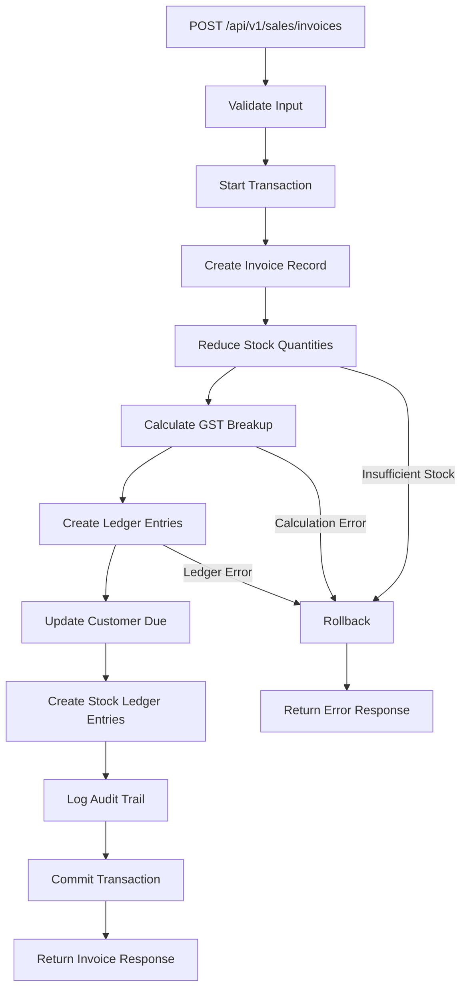
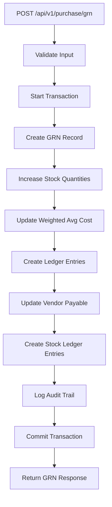
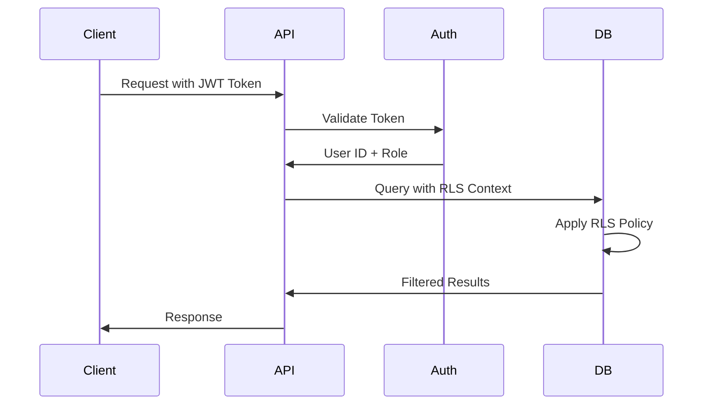

# Design Document: BizPulse24 ERP Backend System

## Overview

BizPulse24 is a production-ready ERP backend system designed for Indian retail businesses. The system provides comprehensive business management capabilities including inventory management, sales and billing, purchase management, party management, financial accounting, GST compliance, and reporting.

### Key Design Principles

1. **Event-Driven Architecture**: Single API operations trigger cascading effects across multiple modules
2. **Transactional Integrity**: All multi-module operations execute within database transactions
3. **GST Compliance**: Built-in GST calculation and reporting for Indian tax regulations
4. **Audit Trail**: Comprehensive logging of all system activities
5. **Multi-Tenancy**: Row-level security ensuring data isolation between companies
6. **Financial Year Locking**: Immutable accounting periods for compliance

### Technology Stack

- **Backend Framework**: Node.js with TypeScript and Express.js
- **Database**: Supabase PostgreSQL with Row Level Security (RLS)
- **Authentication**: Supabase Auth with JWT tokens
- **API Design**: RESTful APIs with OpenAPI documentation
- **ORM**: Prisma for type-safe database access
- **Testing**: Jest for unit tests, fast-check for property-based tests

### System Architecture

The system follows a layered architecture:

```
┌─────────────────────────────────────────────────────────┐
│                     API Layer                            │
│  (Express Routes, Middleware, Validation)                │
└─────────────────────────────────────────────────────────┘
                          │
┌─────────────────────────────────────────────────────────┐
│                   Service Layer                          │
│  (Business Logic, Transaction Orchestration)             │
└─────────────────────────────────────────────────────────┘
                          │
┌─────────────────────────────────────────────────────────┐
│                   Engine Layer                           │
│  (GST_Engine, Ledger_Engine, Audit_Logger)              │
└─────────────────────────────────────────────────────────┘
                          │
┌─────────────────────────────────────────────────────────┐
│                   Data Layer                             │
│  (Prisma ORM, Database Access)                          │
└─────────────────────────────────────────────────────────┘
                          │
┌─────────────────────────────────────────────────────────┐
│              Supabase PostgreSQL                         │
│  (RLS Policies, Triggers, Constraints)                  │
└─────────────────────────────────────────────────────────┘
```


## Architecture

### Module Organization

The system is organized into six core modules:

1. **Inventory Module**: Product catalog, stock management, batch tracking, locations
2. **Sales Module**: Invoices, POS billing, returns, refunds, challans
3. **Purchase Module**: Purchase orders, GRN, purchase returns
4. **Finance Module**: Payments, expenses, ledgers, financial reports
5. **Party Module**: Customer and vendor master data
6. **Reports Module**: GST reports, financial reports, operational reports

### Event-Driven Flow Pattern

Each primary operation follows this pattern:

```
API Request → Validation → Transaction Start
    ↓
Primary Module Action (e.g., Create Invoice)
    ↓
Side Effect 1: Update Inventory (Stock Ledger)
    ↓
Side Effect 2: Calculate GST (GST Engine)
    ↓
Side Effect 3: Update Ledgers (Ledger Engine)
    ↓
Side Effect 4: Update Party Dues (Finance Module)
    ↓
Side Effect 5: Audit Logging (Audit Logger)
    ↓
Transaction Commit → API Response
```

If any step fails, the entire transaction rolls back.

### Multi-Module Impact Examples

#### Sales Invoice Creation Flow



#### Purchase GRN Flow



### Authentication and Authorization Flow




## Components and Interfaces

### Core Components

#### 1. GST_Engine

Responsible for calculating and storing GST breakup based on Indian tax regulations.

**Interface:**

```typescript
interface GSTCalculation {
  taxableAmount: number;
  gstRate: number;
  cgst: number;
  sgst: number;
  igst: number;
  totalGst: number;
  totalAmount: number;
}

class GSTEngine {
  /**
   * Calculate GST based on customer location and company location
   * Intra-state: CGST + SGST
   * Inter-state: IGST
   */
  calculateGST(
    taxableAmount: number,
    gstRate: number,
    customerState: string,
    companyState: string
  ): GSTCalculation;

  /**
   * Create GST entries in database for invoice line items
   */
  async createGSTEntries(
    invoiceId: string,
    lineItems: InvoiceLineItem[],
    customerState: string,
    tx: Transaction
  ): Promise<void>;

  /**
   * Create reversing GST entries for returns
   */
  async reverseGSTEntries(
    originalInvoiceId: string,
    returnLineItems: ReturnLineItem[],
    tx: Transaction
  ): Promise<void>;
}
```

**Logic:**

- If customer state == company state: CGST = SGST = (taxableAmount × gstRate) / 2
- If customer state != company state: IGST = taxableAmount × gstRate
- Total GST = CGST + SGST (or IGST)
- Total Amount = taxableAmount + Total GST

#### 2. Ledger_Engine

Implements double-entry bookkeeping for all financial transactions.

**Interface:**

```typescript
interface LedgerEntry {
  id: string;
  date: Date;
  accountHead: string;
  debitAmount: number;
  creditAmount: number;
  narration: string;
  referenceType: string; // 'INVOICE', 'PAYMENT', 'EXPENSE', etc.
  referenceId: string;
  companyId: string;
  createdBy: string;
}

class LedgerEngine {
  /**
   * Create ledger entries ensuring debits = credits
   */
  async createEntries(
    entries: Omit<LedgerEntry, 'id'>[],
    tx: Transaction
  ): Promise<LedgerEntry[]>;

  /**
   * Create sales invoice ledger entries
   * Debit: Customer Receivables (or Cash)
   * Credit: Sales Account
   */
  async createSalesLedgerEntries(
    invoice: Invoice,
    tx: Transaction
  ): Promise<void>;

  /**
   * Create purchase ledger entries
   * Debit: Purchase Account
   * Credit: Vendor Payables (or Cash)
   */
  async createPurchaseLedgerEntries(
    grn: GRN,
    tx: Transaction
  ): Promise<void>;

  /**
   * Create payment receipt entries
   * Debit: Cash/Bank
   * Credit: Customer Receivables
   */
  async createPaymentReceiptEntries(
    payment: Payment,
    tx: Transaction
  ): Promise<void>;

  /**
   * Create payment to vendor entries
   * Debit: Vendor Payables
   * Credit: Cash/Bank
   */
  async createVendorPaymentEntries(
    payment: Payment,
    tx: Transaction
  ): Promise<void>;

  /**
   * Calculate running balance for an account
   */
  async getAccountBalance(
    accountHead: string,
    asOfDate: Date
  ): Promise<number>;
}
```

**Standard Account Heads:**

- Assets: Cash, Bank, Customer Receivables, Inventory
- Liabilities: Vendor Payables, GST Payable
- Income: Sales, Other Income
- Expenses: Purchase, Rent, Salary, Utilities, Marketing, Transportation

#### 3. Audit_Logger

Records all system activities for compliance and troubleshooting.

**Interface:**

```typescript
interface AuditLog {
  id: string;
  timestamp: Date;
  userId: string;
  action: string; // 'CREATE', 'UPDATE', 'DELETE', 'READ'
  modtomer-outstanding
│       └── /vendor-payable
├── /company
│   ├── GET /profile
│   ├── PUT /profile
│   └── /templates
├── /financial-years
│   ├── GET /
│   ├── POST /
│   └── PUT /:id/lock
├── /audit
│   └── GET /logs
└── /health
    ├── GET /
    └── GET /db
```

customers
│   └── /vendors
├── /finance
│   ├── /payments
│   │   ├── /receipts
│   │   └── /vendor-payments
│   ├── /income
│   ├── /expenses
│   └── /ledgers
├── /reports
│   ├── /gst
│   │   ├── /summary
│   │   ├── /gstr1
│   │   └── /gstr3b
│   ├── /financial
│   │   ├── /profit-loss
│   │   ├── /balance-sheet
│   │   └── /cash-flow
│   ├── /sales
│   │   ├── /daily-summary
│   │   └── /item-wise
│   ├── /inventory
│   │   ├── /stock-valuation
│   │   └── /stock-ageing
│   └── /parties
│       ├── /cus
│   │   ├── PUT /:id
│   │   ├── DELETE /:id
│   │   └── GET /search?barcode=xxx
│   ├── /categories
│   ├── /brands
│   ├── /locations
│   ├── /stock
│   │   ├── GET /current
│   │   ├── GET /movements
│   │   ├── POST /transfer
│   │   └── GET /alerts
│   └── /batches
├── /sales
│   ├── /invoices
│   │   ├── GET /
│   │   ├── POST /
│   │   ├── GET /:id
│   │   └── GET /:id/pdf
│   ├── /returns
│   ├── /pos
│   └── /challans
├── /purchase
│   ├── /orders
│   ├── /grn
│   └── /returns
├── /parties
│   ├── /: Promise<Payment>;

  /**
   * Record income entry
   */
  async recordIncome(
    incomeData: CreateIncomeDTO,
    userId: string
  ): Promise<Income>;

  /**
   * Record expense entry
   */
  async recordExpense(
    expenseData: CreateExpenseDTO,
    userId: string
  ): Promise<Expense>;
}
```

### API Endpoints Structure

```
/api/v1
├── /auth
│   ├── POST /login
│   ├── POST /logout
│   ├── POST /refresh
│   └── GET /me
├── /inventory
│   ├── /products
│   │   ├── GET /
│   │   ├── POST /
│   │   ├── GET /:idseReturnDTO,
    userId: string
  ): Promise<PurchaseReturn>;
}
```

#### Finance Service

```typescript
class FinanceService {
  constructor(
    private ledgerEngine: LedgerEngine,
    private auditLogger: AuditLogger
  ) {}

  /**
   * Record payment receipt from customer
   */
  async recordPaymentReceipt(
    paymentData: CreatePaymentDTO,
    userId: string
  ): Promise<Payment>;

  /**
   * Record payment to vendor
   */
  async recordVendorPayment(
    paymentData: CreatePaymentDTO,
    userId: string
  )tor(
    private ledgerEngine: LedgerEngine,
    private stockLedger: StockLedger,
    private auditLogger: AuditLogger
  ) {}

  /**
   * Create purchase order
   */
  async createPurchaseOrder(
    poData: CreatePODTO,
    userId: string
  ): Promise<PurchaseOrder>;

  /**
   * Create GRN with stock and ledger updates
   */
  async createGRN(
    grnData: CreateGRNDTO,
    userId: string
  ): Promise<GRN>;

  /**
   * Process purchase return
   */
  async createPurchaseReturn(
    returnData: CreatePurcha): Promise<SalesReturn>;

  /**
   * Create POS sale
   */
  async createPOSSale(
    saleData: CreatePOSSaleDTO,
    userId: string
  ): Promise<Invoice>;

  /**
   * Create delivery challan
   */
  async createChallan(
    challanData: CreateChallanDTO,
    userId: string
  ): Promise<Challan>;

  /**
   * Convert challan to invoice
   */
  async convertChallanToInvoice(
    challanId: string,
    userId: string
  ): Promise<Invoice>;
}
```

#### Purchase Service

```typescript
class PurchaseService {
  construcSales Service

```typescript
class SalesService {
  constructor(
    private gstEngine: GSTEngine,
    private ledgerEngine: LedgerEngine,
    private stockLedger: StockLedger,
    private auditLogger: AuditLogger
  ) {}

  /**
   * Create sales invoice with all side effects
   */
  async createInvoice(
    invoiceData: CreateInvoiceDTO,
    userId: string
  ): Promise<Invoice>;

  /**
   * Process sales return with reversals
   */
  async createReturn(
    returnData: CreateReturnDTO,
    userId: string
  
    startDate?: Date,
    endDate?: Date
  ): Promise<StockMovement[]>;

  /**
   * Calculate weighted average cost
   */
  async calculateWeightedAvgCost(
    productId: string,
    locationId: string
  ): Promise<number>;

  /**
   * Get batch with earliest expiry (FEFO)
   */
  async getEarliestExpiryBatch(
    productId: string,
    locationId: string,
    requiredQuantity: number
  ): Promise<{ batchNumber: string; expiryDate: Date; availableQty: number }[]>;
}
```

### Service Layer Components

#### amp: Date;
  userId: string;
  costPrice?: number;
}

class StockLedger {
  /**
   * Record stock movement
   */
  async recordMovement(
    movement: Omit<StockMovement, 'id' | 'timestamp'>,
    tx: Transaction
  ): Promise<StockMovement>;

  /**
   * Get current stock for a product at a location
   */
  async getCurrentStock(
    productId: string,
    locationId: string,
    batchNumber?: string
  ): Promise<number>;

  /**
   * Get stock movements for a product
   */
  async getMovements(
    productId: string,ate;
    page: number;
    limit: number;
  }): Promise<{ logs: AuditLog[]; total: number }>;
}
```

#### 4. Stock_Ledger

Tracks all stock movements with complete traceability.

**Interface:**

```typescript
interface StockMovement {
  id: string;
  productId: string;
  locationId: string;
  batchNumber?: string;
  expiryDate?: Date;
  movementType: 'IN' | 'OUT' | 'TRANSFER';
  quantity: number;
  referenceType: string; // 'INVOICE', 'GRN', 'RETURN', 'TRANSFER', 'ADJUSTMENT'
  referenceId: string;
  timestansaction
  ): Promise<void>;

  /**
   * Log authentication failure
   */
  async logAuthFailure(
    email: string,
    ipAddress: string,
    reason: string
  ): Promise<void>;

  /**
   * Log permission denied event
   */
  async logPermissionDenied(
    userId: string,
    action: string,
    resource: string
  ): Promise<void>;

  /**
   * Query audit logs with filters
   */
  async queryLogs(filters: {
    userId?: string;
    module?: string;
    action?: string;
    startDate?: Date;
    endDate?: Dule: string; // 'SALES', 'PURCHASE', 'INVENTORY', etc.
  recordType: string; // 'INVOICE', 'PRODUCT', 'PAYMENT', etc.
  recordId: string;
  oldValues?: Record<string, any>;
  newValues?: Record<string, any>;
  ipAddress?: string;
  userAgent?: string;
}

class AuditLogger {
  /**
   * Log a system activity
   */
  async log(
    action: string,
    module: string,
    recordType: string,
    recordId: string,
    userId: string,
    oldValues?: Record<string, any>,
    newValues?: Record<string, any>,
    tx?: Tr

## Components and Interfaces

### Core Components

#### 1. GST_Engine

Responsible for calculating and storing GST breakup based on Indian tax regulations.

**Interface:**

```typescript
interface GSTCalculation {
  taxableAmount: number;
  gstRate: number;
  cgst: number;
  sgst: number;
  igst: number;
  totalGst: number;
  totalAmount: number;
}

class GSTEngine {
  calculateGST(
    taxableAmount: number,
    gstRate: number,
    customerState: string,
    companyState: string
  ): GSTCalculation;

  async createGSTEntries(
    invoiceId: string,
    lineItems: InvoiceLineItem[],
    customerState: string,
    tx: Transaction
  ): Promise<void>;

  async reverseGSTEntries(
    originalInvoiceId: string,
    returnLineItems: ReturnLineItem[],
    tx: Transaction
  ): Promise<void>;
}
```


**Logic:**

- If customer state == company state: CGST = SGST = (taxableAmount × gstRate) / 2
- If customer state != company state: IGST = taxableAmount × gstRate
- Total GST = CGST + SGST (or IGST)
- Total Amount = taxableAmount + Total GST

#### 2. Ledger_Engine

Implements double-entry bookkeeping for all financial transactions.

**Interface:**

```typescript
interface LedgerEntry {
  id: string;
  date: Date;
  accountHead: string;
  debitAmount: number;
  creditAmount: number;
  narration: string;
  referenceType: string;
  referenceId: string;
  companyId: string;
  createdBy: string;
}

class LedgerEngine {
  async createEntries(
    entries: Omit<LedgerEntry, 'id'>[],
    tx: Transaction
  ): Promise<LedgerEntry[]>;

  async createSalesLedgerEntries(invoice: Invoice, tx: Transaction): Promise<void>;
  async createPurchaseLedgerEntries(grn: GRN, tx: Transaction): Promise<void>;
  async createPaymentReceiptEntries(payment: Payment, tx: Transaction): Promise<void>;
  async createVendorPaymentEntries(payment: Payment, tx: Transaction): Promise<void>;
  async getAccountBalance(accountHead: string, asOfDate: Date): Promise<number>;
}
```

**Standard Account Heads:**

- Assets: Cash, Bank, Customer Receivables, Inventory
- Liabilities: Vendor Payables, GST Payable
- Income: Sales, Other Income
- Expenses: Purchase, Rent, Salary, Utilities, Marketing, Transportation


#### 3. Audit_Logger

Records all system activities for compliance and troubleshooting.

**Interface:**

```typescript
interface AuditLog {
  id: string;
  timestamp: Date;
  userId: string;
  action: string;
  module: string;
  recordType: string;
  recordId: string;
  oldValues?: Record<string, any>;
  newValues?: Record<string, any>;
  ipAddress?: string;
  userAgent?: string;
}

class AuditLogger {
  async log(
    action: string,
    module: string,
    recordType: string,
    recordId: string,
    userId: string,
    oldValues?: Record<string, any>,
    newValues?: Record<string, any>,
    tx?: Transaction
  ): Promise<void>;

  async logAuthFailure(email: string, ipAddress: string, reason: string): Promise<void>;
  async logPermissionDenied(userId: string, action: string, resource: string): Promise<void>;
  async queryLogs(filters: any): Promise<{ logs: AuditLog[]; total: number }>;
}
```


#### 4. Stock_Ledger

Tracks all stock movements with complete traceability.

**Interface:**

```typescript
interface StockMovement {
  id: string;
  productId: string;
  locationId: string;
  batchNumber?: string;
  expiryDate?: Date;
  movementType: 'IN' | 'OUT' | 'TRANSFER';
  quantity: number;
  referenceType: string;
  referenceId: string;
  timestamp: Date;
  userId: string;
  costPrice?: number;
}

class StockLedger {
  async recordMovement(movement: Omit<StockMovement, 'id' | 'timestamp'>, tx: Transaction): Promise<StockMovement>;
  async getCurrentStock(productId: string, locationId: string, batchNumber?: string): Promise<number>;
  async getMovements(productId: string, startDate?: Date, endDate?: Date): Promise<StockMovement[]>;
  async calculateWeightedAvgCost(productId: string, locationId: string): Promise<number>;
  async getEarliestExpiryBatch(productId: string, locationId: string, requiredQuantity: number): Promise<any[]>;
}
```

### Service Layer Components

#### Sales Service

```typescript
class SalesService {
  async createInvoice(invoiceData: CreateInvoiceDTO, userId: string): Promise<Invoice>;
  async createReturn(returnData: CreateReturnDTO, userId: string): Promise<SalesReturn>;
  async createPOSSale(saleData: CreatePOSSaleDTO, userId: string): Promise<Invoice>;
  async createChallan(challanData: CreateChallanDTO, userId: string): Promise<Challan>;
  async convertChallanToInvoice(challanId: string, userId: string): Promise<Invoice>;
}
```

#### Purchase Service

```typescript
class PurchaseService {
  async createPurchaseOrder(poData: CreatePODTO, userId: string): Promise<PurchaseOrder>;
  async createGRN(grnData: CreateGRNDTO, userId: string): Promise<GRN>;
  async createPurchaseReturn(returnData: CreatePurchaseReturnDTO, userId: string): Promise<PurchaseReturn>;
}
```

#### Finance Service

```typescript
class FinanceService {
  async recordPaymentReceipt(paymentData: CreatePaymentDTO, userId: string): Promise<Payment>;
  async recordVendorPayment(paymentData: CreatePaymentDTO, userId: string): Promise<Payment>;
  async recordIncome(incomeData: CreateIncomeDTO, userId: string): Promise<Income>;
  async recordExpense(expenseData: CreateExpenseDTO, userId: string): Promise<Expense>;
}
```


## Data Models

### Database Schema Design

The database follows a normalized design with UUID primary keys, foreign key constraints, and audit fields in all tables.

#### Core Tables

**companies**
```sql
CREATE TABLE companies (
  id UUID PRIMARY KEY DEFAULT gen_random_uuid(),
  name VARCHAR(255) NOT NULL,
  gstin VARCHAR(15) UNIQUE,
  pan VARCHAR(10),
  address TEXT,
  city VARCHAR(100),
  state VARCHAR(100),
  pincode VARCHAR(10),
  phone VARCHAR(20),
  email VARCHAR(255),
  logo_url TEXT,
  created_at TIMESTAMP DEFAULT NOW(),
  updated_at TIMESTAMP DEFAULT NOW(),
  created_by UUID REFERENCES auth.users(id),
  updated_by UUID REFERENCES auth.users(id)
);

CREATE INDEX idx_companies_gstin ON companies(gstin);
```

**financial_years**
```sql
CREATE TABLE financial_years (
  id UUID PRIMARY KEY DEFAULT gen_random_uuid(),
  company_id UUID NOT NULL REFERENCES companies(id),
  name VARCHAR(100) NOT NULL,
  start_date DATE NOT NULL,
  end_date DATE NOT NULL,
  is_locked BOOLEAN DEFAULT FALSE,
  created_at TIMESTAMP DEFAULT NOW(),
  updated_at TIMESTAMP DEFAULT NOW(),
  created_by UUID REFERENCES auth.users(id),
  updated_by UUID REFERENCES auth.users(id),
  CONSTRAINT check_date_range CHECK (end_date > start_date),
  CONSTRAINT unique_fy_dates UNIQUE (company_id, start_date, end_date)
);

CREATE INDEX idx_fy_company ON financial_years(company_id);
CREATE INDEX idx_fy_dates ON financial_years(start_date, end_date);
```


**user_roles**
```sql
CREATE TABLE user_roles (
  id UUID PRIMARY KEY DEFAULT gen_random_uuid(),
  user_id UUID NOT NULL REFERENCES auth.users(id),
  company_id UUID NOT NULL REFERENCES companies(id),
  role VARCHAR(20) NOT NULL CHECK (role IN ('OWNER', 'ADMIN', 'STAFF')),
  created_at TIMESTAMP DEFAULT NOW(),
  updated_at TIMESTAMP DEFAULT NOW(),
  CONSTRAINT unique_user_company UNIQUE (user_id, company_id)
);

CREATE INDEX idx_user_roles_user ON user_roles(user_id);
CREATE INDEX idx_user_roles_company ON user_roles(company_id);
```

#### Inventory Module Tables

**categories**
```sql
CREATE TABLE categories (
  id UUID PRIMARY KEY DEFAULT gen_random_uuid(),
  company_id UUID NOT NULL REFERENCES companies(id),
  name VARCHAR(255) NOT NULL,
  parent_id UUID REFERENCES categories(id),
  description TEXT,
  created_at TIMESTAMP DEFAULT NOW(),
  updated_at TIMESTAMP DEFAULT NOW(),
  created_by UUID REFERENCES auth.users(id),
  updated_by UUID REFERENCES auth.users(id),
  deleted_at TIMESTAMP,
  deleted_by UUID REFERENCES auth.users(id)
);

CREATE INDEX idx_categories_company ON categories(company_id);
CREATE INDEX idx_categories_parent ON categories(parent_id);
```

**brands**
```sql
CREATE TABLE brands (
  id UUID PRIMARY KEY DEFAULT gen_random_uuid(),
  company_id UUID NOT NULL REFERENCES companies(id),
  name VARCHAR(255) NOT NULL,
  description TEXT,
  created_at TIMESTAMP DEFAULT NOW(),
  updated_at TIMESTAMP DEFAULT NOW(),
  created_by UUID REFERENCES auth.users(id),
  updated_by UUID REFERENCES auth.users(id),
  deleted_at TIMESTAMP,
  deleted_by UUID REFERENCES auth.users(id)
);

CREATE INDEX idx_brands_company ON brands(company_id);
```


**products**
```sql
CREATE TABLE products (
  id UUID PRIMARY KEY DEFAULT gen_random_uuid(),
  company_id UUID NOT NULL REFERENCES companies(id),
  name VARCHAR(255) NOT NULL,
  sku VARCHAR(100) UNIQUE NOT NULL,
  barcode VARCHAR(100) UNIQUE,
  hsn_code VARCHAR(8),
  gst_rate DECIMAL(5,2) CHECK (gst_rate IN (0, 5, 12, 18, 28)),
  category_id UUID REFERENCES categories(id),
  brand_id UUID REFERENCES brands(id),
  unit_of_measure VARCHAR(50),
  mrp DECIMAL(15,2),
  cost_price DECIMAL(15,2),
  selling_price DECIMAL(15,2),
  min_stock_level INTEGER DEFAULT 10,
  has_batch_tracking BOOLEAN DEFAULT FALSE,
  description TEXT,
  created_at TIMESTAMP DEFAULT NOW(),
  updated_at TIMESTAMP DEFAULT NOW(),
  created_by UUID REFERENCES auth.users(id),
  updated_by UUID REFERENCES auth.users(id),
  deleted_at TIMESTAMP,
  deleted_by UUID REFERENCES auth.users(id)
);

CREATE INDEX idx_products_company ON products(company_id);
CREATE INDEX idx_products_sku ON products(sku);
CREATE INDEX idx_products_barcode ON products(barcode);
CREATE INDEX idx_products_category ON products(category_id);
CREATE INDEX idx_products_hsn ON products(hsn_code);
```

**locations**
```sql
CREATE TABLE locations (
  id UUID PRIMARY KEY DEFAULT gen_random_uuid(),
  company_id UUID NOT NULL REFERENCES companies(id),
  name VARCHAR(255) NOT NULL,
  address TEXT,
  city VARCHAR(100),
  state VARCHAR(100),
  is_default BOOLEAN DEFAULT FALSE,
  created_at TIMESTAMP DEFAULT NOW(),
  updated_at TIMESTAMP DEFAULT NOW(),
  created_by UUID REFERENCES auth.users(id),
  updated_by UUID REFERENCES auth.users(id)
);

CREATE INDEX idx_locations_company ON locations(company_id);
```


**stock**
```sql
CREATE TABLE stock (
  id UUID PRIMARY KEY DEFAULT gen_random_uuid(),
  company_id UUID NOT NULL REFERENCES companies(id),
  product_id UUID NOT NULL REFERENCES products(id),
  location_id UUID NOT NULL REFERENCES locations(id),
  batch_number VARCHAR(100),
  expiry_date DATE,
  quantity DECIMAL(15,3) NOT NULL DEFAULT 0,
  weighted_avg_cost DECIMAL(15,2),
  updated_at TIMESTAMP DEFAULT NOW(),
  CONSTRAINT unique_product_location_batch UNIQUE (product_id, location_id, batch_number)
);

CREATE INDEX idx_stock_product ON stock(product_id);
CREATE INDEX idx_stock_location ON stock(location_id);
CREATE INDEX idx_stock_batch ON stock(batch_number);
CREATE INDEX idx_stock_expiry ON stock(expiry_date);
```

**stock_ledger**
```sql
CREATE TABLE stock_ledger (
  id UUID PRIMARY KEY DEFAULT gen_random_uuid(),
  company_id UUID NOT NULL REFERENCES companies(id),
  product_id UUID NOT NULL REFERENCES products(id),
  location_id UUID NOT NULL REFERENCES locations(id),
  batch_number VARCHAR(100),
  expiry_date DATE,
  movement_type VARCHAR(20) NOT NULL CHECK (movement_type IN ('IN', 'OUT', 'TRANSFER')),
  quantity DECIMAL(15,3) NOT NULL,
  reference_type VARCHAR(50) NOT NULL,
  reference_id UUID NOT NULL,
  cost_price DECIMAL(15,2),
  timestamp TIMESTAMP DEFAULT NOW(),
  user_id UUID REFERENCES auth.users(id)
);

CREATE INDEX idx_stock_ledger_product ON stock_ledger(product_id);
CREATE INDEX idx_stock_ledger_location ON stock_ledger(location_id);
CREATE INDEX idx_stock_ledger_reference ON stock_ledger(reference_type, reference_id);
CREATE INDEX idx_stock_ledger_timestamp ON stock_ledger(timestamp);
```

**stock_alerts**
```sql
CREATE TABLE stock_alerts (
  id UUID PRIMARY KEY DEFAULT gen_random_uuid(),
  company_id UUID NOT NULL REFERENCES companies(id),
  product_id UUID NOT NULL REFERENCES products(id),
  location_id UUID NOT NULL REFERENCES locations(id),
  current_quantity DECIMAL(15,3),
  min_quantity DECIMAL(15,3),
  alert_type VARCHAR(20) CHECK (alert_type IN ('LOW_STOCK', 'OUT_OF_STOCK')),
  is_acknowledged BOOLEAN DEFAULT FALSE,
  created_at TIMESTAMP DEFAULT NOW(),
  acknowledged_at TIMESTAMP,
  acknowledged_by UUID REFERENCES auth.users(id)
);

CREATE INDEX idx_stock_alerts_product ON stock_alerts(product_id);
CREATE INDEX idx_stock_alerts_acknowledged ON stock_alerts(is_acknowledged);
```


#### Party Module Tables

**customers**
```sql
CREATE TABLE customers (
  id UUID PRIMARY KEY DEFAULT gen_random_uuid(),
  company_id UUID NOT NULL REFERENCES companies(id),
  name VARCHAR(255) NOT NULL,
  gstin VARCHAR(15),
  pan VARCHAR(10),
  phone VARCHAR(20),
  email VARCHAR(255),
  billing_address TEXT,
  billing_city VARCHAR(100),
  billing_state VARCHAR(100),
  billing_pincode VARCHAR(10),
  shipping_address TEXT,
  shipping_city VARCHAR(100),
  shipping_state VARCHAR(100),
  shipping_pincode VARCHAR(10),
  credit_limit DECIMAL(15,2) DEFAULT 0,
  created_at TIMESTAMP DEFAULT NOW(),
  updated_at TIMESTAMP DEFAULT NOW(),
  created_by UUID REFERENCES auth.users(id),
  updated_by UUID REFERENCES auth.users(id),
  deleted_at TIMESTAMP,
  deleted_by UUID REFERENCES auth.users(id),
  CONSTRAINT unique_customer_gstin UNIQUE (company_id, gstin)
);

CREATE INDEX idx_customers_company ON customers(company_id);
CREATE INDEX idx_customers_gstin ON customers(gstin);
CREATE INDEX idx_customers_phone ON customers(phone);
```

**vendors**
```sql
CREATE TABLE vendors (
  id UUID PRIMARY KEY DEFAULT gen_random_uuid(),
  company_id UUID NOT NULL REFERENCES companies(id),
  name VARCHAR(255) NOT NULL,
  gstin VARCHAR(15),
  pan VARCHAR(10),
  phone VARCHAR(20),
  email VARCHAR(255),
  address TEXT,
  city VARCHAR(100),
  state VARCHAR(100),
  pincode VARCHAR(10),
  created_at TIMESTAMP DEFAULT NOW(),
  updated_at TIMESTAMP DEFAULT NOW(),
  created_by UUID REFERENCES auth.users(id),
  updated_by UUID REFERENCES auth.users(id),
  deleted_at TIMESTAMP,
  deleted_by UUID REFERENCES auth.users(id),
  CONSTRAINT unique_vendor_gstin UNIQUE (company_id, gstin)
);

CREATE INDEX idx_vendors_company ON vendors(company_id);
CREATE INDEX idx_vendors_gstin ON vendors(gstin);
```


#### Sales Module Tables

**sales_invoices**
```sql
CREATE TABLE sales_invoices (
  id UUID PRIMARY KEY DEFAULT gen_random_uuid(),
  company_id UUID NOT NULL REFERENCES companies(id),
  invoice_number VARCHAR(100) UNIQUE NOT NULL,
  invoice_date DATE NOT NULL,
  customer_id UUID NOT NULL REFERENCES customers(id),
  location_id UUID NOT NULL REFERENCES locations(id),
  sale_type VARCHAR(20) CHECK (sale_type IN ('CREDIT', 'CASH', 'POS')),
  payment_mode VARCHAR(20) CHECK (payment_mode IN ('CASH', 'BANK', 'CHEQUE', 'UPI', 'CARD')),
  subtotal DECIMAL(15,2) NOT NULL,
  discount_amount DECIMAL(15,2) DEFAULT 0,
  taxable_amount DECIMAL(15,2) NOT NULL,
  cgst_amount DECIMAL(15,2) DEFAULT 0,
  sgst_amount DECIMAL(15,2) DEFAULT 0,
  igst_amount DECIMAL(15,2) DEFAULT 0,
  total_gst DECIMAL(15,2) NOT NULL,
  total_amount DECIMAL(15,2) NOT NULL,
  notes TEXT,
  financial_year_id UUID REFERENCES financial_years(id),
  created_at TIMESTAMP DEFAULT NOW(),
  updated_at TIMESTAMP DEFAULT NOW(),
  created_by UUID REFERENCES auth.users(id),
  updated_by UUID REFERENCES auth.users(id)
);

CREATE INDEX idx_sales_invoices_company ON sales_invoices(company_id);
CREATE INDEX idx_sales_invoices_number ON sales_invoices(invoice_number);
CREATE INDEX idx_sales_invoices_customer ON sales_invoices(customer_id);
CREATE INDEX idx_sales_invoices_date ON sales_invoices(invoice_date);
CREATE INDEX idx_sales_invoices_fy ON sales_invoices(financial_year_id);
```

**sales_invoice_items**
```sql
CREATE TABLE sales_invoice_items (
  id UUID PRIMARY KEY DEFAULT gen_random_uuid(),
  invoice_id UUID NOT NULL REFERENCES sales_invoices(id) ON DELETE CASCADE,
  product_id UUID NOT NULL REFERENCES products(id),
  batch_number VARCHAR(100),
  expiry_date DATE,
  quantity DECIMAL(15,3) NOT NULL,
  unit_price DECIMAL(15,2) NOT NULL,
  discount_percent DECIMAL(5,2) DEFAULT 0,
  discount_amount DECIMAL(15,2) DEFAULT 0,
  taxable_amount DECIMAL(15,2) NOT NULL,
  gst_rate DECIMAL(5,2) NOT NULL,
  cgst_amount DECIMAL(15,2) DEFAULT 0,
  sgst_amount DECIMAL(15,2) DEFAULT 0,
  igst_amount DECIMAL(15,2) DEFAULT 0,
  total_amount DECIMAL(15,2) NOT NULL,
  created_at TIMESTAMP DEFAULT NOW()
);

CREATE INDEX idx_invoice_items_invoice ON sales_invoice_items(invoice_id);
CREATE INDEX idx_invoice_items_product ON sales_invoice_items(product_id);
```


**sales_returns**
```sql
CREATE TABLE sales_returns (
  id UUID PRIMARY KEY DEFAULT gen_random_uuid(),
  company_id UUID NOT NULL REFERENCES companies(id),
  return_number VARCHAR(100) UNIQUE NOT NULL,
  return_date DATE NOT NULL,
  original_invoice_id UUID NOT NULL REFERENCES sales_invoices(id),
  customer_id UUID NOT NULL REFERENCES customers(id),
  location_id UUID NOT NULL REFERENCES locations(id),
  subtotal DECIMAL(15,2) NOT NULL,
  total_gst DECIMAL(15,2) NOT NULL,
  total_amount DECIMAL(15,2) NOT NULL,
  reason TEXT,
  financial_year_id UUID REFERENCES financial_years(id),
  created_at TIMESTAMP DEFAULT NOW(),
  created_by UUID REFERENCES auth.users(id)
);

CREATE INDEX idx_sales_returns_company ON sales_returns(company_id);
CREATE INDEX idx_sales_returns_invoice ON sales_returns(original_invoice_id);
CREATE INDEX idx_sales_returns_date ON sales_returns(return_date);
```

**sales_return_items**
```sql
CREATE TABLE sales_return_items (
  id UUID PRIMARY KEY DEFAULT gen_random_uuid(),
  return_id UUID NOT NULL REFERENCES sales_returns(id) ON DELETE CASCADE,
  product_id UUID NOT NULL REFERENCES products(id),
  batch_number VARCHAR(100),
  quantity DECIMAL(15,3) NOT NULL,
  unit_price DECIMAL(15,2) NOT NULL,
  taxable_amount DECIMAL(15,2) NOT NULL,
  gst_rate DECIMAL(5,2) NOT NULL,
  cgst_amount DECIMAL(15,2) DEFAULT 0,
  sgst_amount DECIMAL(15,2) DEFAULT 0,
  igst_amount DECIMAL(15,2) DEFAULT 0,
  total_amount DECIMAL(15,2) NOT NULL,
  created_at TIMESTAMP DEFAULT NOW()
);

CREATE INDEX idx_return_items_return ON sales_return_items(return_id);
CREATE INDEX idx_return_items_product ON sales_return_items(product_id);
```

**delivery_challans**
```sql
CREATE TABLE delivery_challans (
  id UUID PRIMARY KEY DEFAULT gen_random_uuid(),
  company_id UUID NOT NULL REFERENCES companies(id),
  challan_number VARCHAR(100) UNIQUE NOT NULL,
  challan_date DATE NOT NULL,
  customer_id UUID NOT NULL REFERENCES customers(id),
  location_id UUID NOT NULL REFERENCES locations(id),
  converted_to_invoice_id UUID REFERENCES sales_invoices(id),
  is_converted BOOLEAN DEFAULT FALSE,
  notes TEXT,
  created_at TIMESTAMP DEFAULT NOW(),
  created_by UUID REFERENCES auth.users(id)
);

CREATE INDEX idx_challans_company ON delivery_challans(company_id);
CREATE INDEX idx_challans_customer ON delivery_challans(customer_id);
CREATE INDEX idx_challans_converted ON delivery_challans(is_converted);
```


#### Purchase Module Tables

**purchase_orders**
```sql
CREATE TABLE purchase_orders (
  id UUID PRIMARY KEY DEFAULT gen_random_uuid(),
  company_id UUID NOT NULL REFERENCES companies(id),
  po_number VARCHAR(100) UNIQUE NOT NULL,
  po_date DATE NOT NULL,
  vendor_id UUID NOT NULL REFERENCES vendors(id),
  expected_delivery_date DATE,
  total_amount DECIMAL(15,2) NOT NULL,
  status VARCHAR(20) CHECK (status IN ('PENDING', 'PARTIAL', 'COMPLETED', 'CANCELLED')),
  notes TEXT,
  created_at TIMESTAMP DEFAULT NOW(),
  updated_at TIMESTAMP DEFAULT NOW(),
  created_by UUID REFERENCES auth.users(id),
  updated_by UUID REFERENCES auth.users(id)
);

CREATE INDEX idx_po_company ON purchase_orders(company_id);
CREATE INDEX idx_po_vendor ON purchase_orders(vendor_id);
CREATE INDEX idx_po_date ON purchase_orders(po_date);
```

**purchase_order_items**
```sql
CREATE TABLE purchase_order_items (
  id UUID PRIMARY KEY DEFAULT gen_random_uuid(),
  po_id UUID NOT NULL REFERENCES purchase_orders(id) ON DELETE CASCADE,
  product_id UUID NOT NULL REFERENCES products(id),
  quantity DECIMAL(15,3) NOT NULL,
  unit_price DECIMAL(15,2) NOT NULL,
  total_amount DECIMAL(15,2) NOT NULL,
  received_quantity DECIMAL(15,3) DEFAULT 0,
  created_at TIMESTAMP DEFAULT NOW()
);

CREATE INDEX idx_po_items_po ON purchase_order_items(po_id);
CREATE INDEX idx_po_items_product ON purchase_order_items(product_id);
```


**goods_receipt_notes**
```sql
CREATE TABLE goods_receipt_notes (
  id UUID PRIMARY KEY DEFAULT gen_random_uuid(),
  company_id UUID NOT NULL REFERENCES companies(id),
  grn_number VARCHAR(100) UNIQUE NOT NULL,
  grn_date DATE NOT NULL,
  po_id UUID REFERENCES purchase_orders(id),
  vendor_id UUID NOT NULL REFERENCES vendors(id),
  location_id UUID NOT NULL REFERENCES locations(id),
  purchase_type VARCHAR(20) CHECK (purchase_type IN ('CREDIT', 'CASH')),
  payment_mode VARCHAR(20) CHECK (payment_mode IN ('CASH', 'BANK', 'CHEQUE', 'UPI', 'CARD')),
  total_amount DECIMAL(15,2) NOT NULL,
  notes TEXT,
  financial_year_id UUID REFERENCES financial_years(id),
  created_at TIMESTAMP DEFAULT NOW(),
  created_by UUID REFERENCES auth.users(id)
);

CREATE INDEX idx_grn_company ON goods_receipt_notes(company_id);
CREATE INDEX idx_grn_vendor ON goods_receipt_notes(vendor_id);
CREATE INDEX idx_grn_po ON goods_receipt_notes(po_id);
CREATE INDEX idx_grn_date ON goods_receipt_notes(grn_date);
```

**grn_items**
```sql
CREATE TABLE grn_items (
  id UUID PRIMARY KEY DEFAULT gen_random_uuid(),
  grn_id UUID NOT NULL REFERENCES goods_receipt_notes(id) ON DELETE CASCADE,
  product_id UUID NOT NULL REFERENCES products(id),
  batch_number VARCHAR(100),
  expiry_date DATE,
  quantity DECIMAL(15,3) NOT NULL,
  unit_price DECIMAL(15,2) NOT NULL,
  total_amount DECIMAL(15,2) NOT NULL,
  created_at TIMESTAMP DEFAULT NOW()
);

CREATE INDEX idx_grn_items_grn ON grn_items(grn_id);
CREATE INDEX idx_grn_items_product ON grn_items(product_id);
```

**purchase_returns**
```sql
CREATE TABLE purchase_returns (
  id UUID PRIMARY KEY DEFAULT gen_random_uuid(),
  company_id UUID NOT NULL REFERENCES companies(id),
  return_number VARCHAR(100) UNIQUE NOT NULL,
  return_date DATE NOT NULL,
  original_grn_id UUID NOT NULL REFERENCES goods_receipt_notes(id),
  vendor_id UUID NOT NULL REFERENCES vendors(id),
  location_id UUID NOT NULL REFERENCES locations(id),
  total_amount DECIMAL(15,2) NOT NULL,
  reason TEXT,
  financial_year_id UUID REFERENCES financial_years(id),
  created_at TIMESTAMP DEFAULT NOW(),
  created_by UUID REFERENCES auth.users(id)
);

CREATE INDEX idx_purchase_returns_company ON purchase_returns(company_id);
CREATE INDEX idx_purchase_returns_grn ON purchase_returns(original_grn_id);
CREATE INDEX idx_purchase_returns_date ON purchase_returns(return_date);
```

**purchase_return_items**
```sql
CREATE TABLE purchase_return_items (
  id UUID PRIMARY KEY DEFAULT gen_random_uuid(),
  return_id UUID NOT NULL REFERENCES purchase_returns(id) ON DELETE CASCADE,
  product_id UUID NOT NULL REFERENCES products(id),
  batch_number VARCHAR(100),
  quantity DECIMAL(15,3) NOT NULL,
  unit_price DECIMAL(15,2) NOT NULL,
  total_amount DECIMAL(15,2) NOT NULL,
  created_at TIMESTAMP DEFAULT NOW()
);

CREATE INDEX idx_purchase_return_items_return ON purchase_return_items(return_id);
CREATE INDEX idx_purchase_return_items_product ON purchase_return_items(product_id);
```


#### Finance Module Tables

**payments**
```sql
CREATE TABLE payments (
  id UUID PRIMARY KEY DEFAULT gen_random_uuid(),
  company_id UUID NOT NULL REFERENCES companies(id),
  payment_number VARCHAR(100) UNIQUE NOT NULL,
  payment_date DATE NOT NULL,
  payment_type VARCHAR(20) CHECK (payment_type IN ('RECEIPT', 'PAYMENT')),
  party_type VARCHAR(20) CHECK (party_type IN ('CUSTOMER', 'VENDOR')),
  party_id UUID NOT NULL,
  amount DECIMAL(15,2) NOT NULL,
  payment_mode VARCHAR(20) CHECK (payment_mode IN ('CASH', 'BANK', 'CHEQUE', 'UPI', 'CARD')),
  reference_number VARCHAR(100),
  notes TEXT,
  financial_year_id UUID REFERENCES financial_years(id),
  created_at TIMESTAMP DEFAULT NOW(),
  created_by UUID REFERENCES auth.users(id)
);

CREATE INDEX idx_payments_company ON payments(company_id);
CREATE INDEX idx_payments_party ON payments(party_type, party_id);
CREATE INDEX idx_payments_date ON payments(payment_date);
```

**income_entries**
```sql
CREATE TABLE income_entries (
  id UUID PRIMARY KEY DEFAULT gen_random_uuid(),
  company_id UUID NOT NULL REFERENCES companies(id),
  entry_date DATE NOT NULL,
  amount DECIMAL(15,2) NOT NULL,
  category VARCHAR(100) NOT NULL,
  payment_mode VARCHAR(20) CHECK (payment_mode IN ('CASH', 'BANK', 'CHEQUE', 'UPI', 'CARD')),
  description TEXT,
  financial_year_id UUID REFERENCES financial_years(id),
  created_at TIMESTAMP DEFAULT NOW(),
  created_by UUID REFERENCES auth.users(id)
);

CREATE INDEX idx_income_company ON income_entries(company_id);
CREATE INDEX idx_income_date ON income_entries(entry_date);
```

**expense_entries**
```sql
CREATE TABLE expense_entries (
  id UUID PRIMARY KEY DEFAULT gen_random_uuid(),
  company_id UUID NOT NULL REFERENCES companies(id),
  entry_date DATE NOT NULL,
  amount DECIMAL(15,2) NOT NULL,
  category VARCHAR(100) NOT NULL,
  payment_mode VARCHAR(20) CHECK (payment_mode IN ('CASH', 'BANK', 'CHEQUE', 'UPI', 'CARD')),
  description TEXT,
  financial_year_id UUID REFERENCES financial_years(id),
  created_at TIMESTAMP DEFAULT NOW(),
  created_by UUID REFERENCES auth.users(id)
);

CREATE INDEX idx_expense_company ON expense_entries(company_id);
CREATE INDEX idx_expense_date ON expense_entries(entry_date);
CREATE INDEX idx_expense_category ON expense_entries(category);
```


**ledger_entries**
```sql
CREATE TABLE ledger_entries (
  id UUID PRIMARY KEY DEFAULT gen_random_uuid(),
  company_id UUID NOT NULL REFERENCES companies(id),
  entry_date DATE NOT NULL,
  account_head VARCHAR(100) NOT NULL,
  debit_amount DECIMAL(15,2) DEFAULT 0,
  credit_amount DECIMAL(15,2) DEFAULT 0,
  narration TEXT,
  reference_type VARCHAR(50) NOT NULL,
  reference_id UUID NOT NULL,
  financial_year_id UUID REFERENCES financial_years(id),
  created_at TIMESTAMP DEFAULT NOW(),
  created_by UUID REFERENCES auth.users(id),
  CONSTRAINT check_debit_or_credit CHECK (
    (debit_amount > 0 AND credit_amount = 0) OR 
    (credit_amount > 0 AND debit_amount = 0)
  )
);

CREATE INDEX idx_ledger_company ON ledger_entries(company_id);
CREATE INDEX idx_ledger_account ON ledger_entries(account_head);
CREATE INDEX idx_ledger_date ON ledger_entries(entry_date);
CREATE INDEX idx_ledger_reference ON ledger_entries(reference_type, reference_id);
```

**customer_dues**
```sql
CREATE TABLE customer_dues (
  id UUID PRIMARY KEY DEFAULT gen_random_uuid(),
  company_id UUID NOT NULL REFERENCES companies(id),
  customer_id UUID NOT NULL REFERENCES customers(id),
  outstanding_amount DECIMAL(15,2) DEFAULT 0,
  updated_at TIMESTAMP DEFAULT NOW(),
  CONSTRAINT unique_customer_due UNIQUE (company_id, customer_id)
);

CREATE INDEX idx_customer_dues_customer ON customer_dues(customer_id);
```

**vendor_payables**
```sql
CREATE TABLE vendor_payables (
  id UUID PRIMARY KEY DEFAULT gen_random_uuid(),
  company_id UUID NOT NULL REFERENCES companies(id),
  vendor_id UUID NOT NULL REFERENCES vendors(id),
  outstanding_amount DECIMAL(15,2) DEFAULT 0,
  updated_at TIMESTAMP DEFAULT NOW(),
  CONSTRAINT unique_vendor_payable UNIQUE (company_id, vendor_id)
);

CREATE INDEX idx_vendor_payables_vendor ON vendor_payables(vendor_id);
```


#### System Tables

**audit_logs**
```sql
CREATE TABLE audit_logs (
  id UUID PRIMARY KEY DEFAULT gen_random_uuid(),
  company_id UUID REFERENCES companies(id),
  timestamp TIMESTAMP DEFAULT NOW(),
  user_id UUID REFERENCES auth.users(id),
  action VARCHAR(50) NOT NULL,
  module VARCHAR(50) NOT NULL,
  record_type VARCHAR(50) NOT NULL,
  record_id UUID,
  old_values JSONB,
  new_values JSONB,
  ip_address VARCHAR(45),
  user_agent TEXT
);

CREATE INDEX idx_audit_company ON audit_logs(company_id);
CREATE INDEX idx_audit_user ON audit_logs(user_id);
CREATE INDEX idx_audit_timestamp ON audit_logs(timestamp);
CREATE INDEX idx_audit_module ON audit_logs(module);
CREATE INDEX idx_audit_action ON audit_logs(action);
```

**invoice_templates**
```sql
CREATE TABLE invoice_templates (
  id UUID PRIMARY KEY DEFAULT gen_random_uuid(),
  company_id UUID NOT NULL REFERENCES companies(id),
  name VARCHAR(255) NOT NULL,
  header_content TEXT,
  footer_content TEXT,
  logo_url TEXT,
  layout_config JSONB,
  is_default BOOLEAN DEFAULT FALSE,
  created_at TIMESTAMP DEFAULT NOW(),
  updated_at TIMESTAMP DEFAULT NOW(),
  created_by UUID REFERENCES auth.users(id),
  updated_by UUID REFERENCES auth.users(id)
);

CREATE INDEX idx_templates_company ON invoice_templates(company_id);
```

**discount_rules**
```sql
CREATE TABLE discount_rules (
  id UUID PRIMARY KEY DEFAULT gen_random_uuid(),
  company_id UUID NOT NULL REFERENCES companies(id),
  name VARCHAR(255) NOT NULL,
  discount_type VARCHAR(20) CHECK (discount_type IN ('PERCENTAGE', 'FIXED')),
  discount_value DECIMAL(15,2) NOT NULL,
  applicable_to VARCHAR(20) CHECK (applicable_to IN ('PRODUCT', 'CATEGORY', 'ALL')),
  applicable_ids UUID[],
  start_date DATE,
  end_date DATE,
  is_active BOOLEAN DEFAULT TRUE,
  created_at TIMESTAMP DEFAULT NOW(),
  updated_at TIMESTAMP DEFAULT NOW(),
  created_by UUID REFERENCES auth.users(id),
  updated_by UUID REFERENCES auth.users(id)
);

CREATE INDEX idx_discount_rules_company ON discount_rules(company_id);
CREATE INDEX idx_discount_rules_dates ON discount_rules(start_date, end_date);
```

**backup_metadata**
```sql
CREATE TABLE backup_metadata (
  id UUID PRIMARY KEY DEFAULT gen_random_uuid(),
  backup_timestamp TIMESTAMP NOT NULL,
  backup_size BIGINT,
  storage_location TEXT,
  backup_type VARCHAR(50),
  created_at TIMESTAMP DEFAULT NOW()
);

CREATE INDEX idx_backup_timestamp ON backup_metadata(backup_timestamp);
```


### Row Level Security (RLS) Policies

All tables must have RLS enabled to ensure multi-tenancy and role-based access control.

**Example RLS Policy for Products:**

```sql
-- Enable RLS
ALTER TABLE products ENABLE ROW LEVEL SECURITY;

-- Policy for SELECT
CREATE POLICY products_select_policy ON products
  FOR SELECT
  USING (
    company_id IN (
      SELECT company_id FROM user_roles 
      WHERE user_id = auth.uid()
    )
  );

-- Policy for INSERT (Owner and Admin only)
CREATE POLICY products_insert_policy ON products
  FOR INSERT
  WITH CHECK (
    company_id IN (
      SELECT company_id FROM user_roles 
      WHERE user_id = auth.uid() 
      AND role IN ('OWNER', 'ADMIN')
    )
  );

-- Policy for UPDATE (Owner and Admin only)
CREATE POLICY products_update_policy ON products
  FOR UPDATE
  USING (
    company_id IN (
      SELECT company_id FROM user_roles 
      WHERE user_id = auth.uid() 
      AND role IN ('OWNER', 'ADMIN')
    )
  );

-- Policy for DELETE (Owner only)
CREATE POLICY products_delete_policy ON products
  FOR DELETE
  USING (
    company_id IN (
      SELECT company_id FROM user_roles 
      WHERE user_id = auth.uid() 
      AND role = 'OWNER'
    )
  );
```

**Similar policies must be created for all tables with appropriate role restrictions.**


### Database Triggers

**Financial Year Lock Enforcement Trigger:**

```sql
CREATE OR REPLACE FUNCTION check_financial_year_lock()
RETURNS TRIGGER AS $$
DECLARE
  fy_locked BOOLEAN;
BEGIN
  -- Check if the transaction date falls in a locked financial year
  SELECT is_locked INTO fy_locked
  FROM financial_years
  WHERE company_id = NEW.company_id
    AND NEW.invoice_date >= start_date
    AND NEW.invoice_date <= end_date
  LIMIT 1;

  IF fy_locked THEN
    RAISE EXCEPTION 'Cannot modify transactions in locked financial year';
  END IF;

  RETURN NEW;
END;
$$ LANGUAGE plpgsql;

-- Apply trigger to sales_invoices
CREATE TRIGGER enforce_fy_lock_sales
  BEFORE INSERT OR UPDATE ON sales_invoices
  FOR EACH ROW
  EXECUTE FUNCTION check_financial_year_lock();

-- Apply trigger to goods_receipt_notes
CREATE TRIGGER enforce_fy_lock_grn
  BEFORE INSERT OR UPDATE ON goods_receipt_notes
  FOR EACH ROW
  EXECUTE FUNCTION check_financial_year_lock();

-- Apply trigger to payments
CREATE TRIGGER enforce_fy_lock_payments
  BEFORE INSERT OR UPDATE ON payments
  FOR EACH ROW
  EXECUTE FUNCTION check_financial_year_lock();
```

**Auto-update Timestamp Trigger:**

```sql
CREATE OR REPLACE FUNCTION update_updated_at()
RETURNS TRIGGER AS $$
BEGIN
  NEW.updated_at = NOW();
  RETURN NEW;
END;
$$ LANGUAGE plpgsql;

-- Apply to all tables with updated_at field
CREATE TRIGGER update_products_timestamp
  BEFORE UPDATE ON products
  FOR EACH ROW
  EXECUTE FUNCTION update_updated_at();

-- Repeat for other tables...
```

**Stock Alert Trigger:**

```sql
CREATE OR REPLACE FUNCTION check_low_stock()
RETURNS TRIGGER AS $$
DECLARE
  min_qty DECIMAL(15,3);
BEGIN
  -- Get minimum stock level for the product
  SELECT min_stock_level INTO min_qty
  FROM products
  WHERE id = NEW.product_id;

  -- Create alert if stock falls below minimum
  IF NEW.quantity < min_qty THEN
    INSERT INTO stock_alerts (
      company_id, product_id, location_id, 
      current_quantity, min_quantity, alert_type
    )
    VALUES (
      NEW.company_id, NEW.product_id, NEW.location_id,
      NEW.quantity, min_qty,
      CASE WHEN NEW.quantity = 0 THEN 'OUT_OF_STOCK' ELSE 'LOW_STOCK' END
    )
    ON CONFLICT (product_id, location_id) 
    WHERE is_acknowledged = FALSE
    DO UPDATE SET 
      current_quantity = NEW.quantity,
      created_at = NOW();
  END IF;

  RETURN NEW;
END;
$$ LANGUAGE plpgsql;

CREATE TRIGGER stock_alert_trigger
  AFTER INSERT OR UPDATE ON stock
  FOR EACH ROW
  EXECUTE FUNCTION check_low_stock();
```


## Error Handling

### Error Response Format

All API errors follow a consistent JSON format:

```typescript
interface ErrorResponse {
  error: {
    code: string;
    message: string;
    details?: any;
    trackingId?: string;
  };
  timestamp: string;
}
```

### HTTP Status Codes

- **400 Bad Request**: Invalid input, validation failures, business rule violations
- **401 Unauthorized**: Missing or invalid JWT token
- **403 Forbidden**: Insufficient permissions, locked financial year operations
- **404 Not Found**: Resource does not exist
- **409 Conflict**: Duplicate key violations, concurrent modification conflicts
- **500 Internal Server Error**: Unexpected server errors with tracking ID

### Error Categories

**Validation Errors (400)**
- Invalid GSTIN format
- Invalid HSN code format
- Invalid GST rate
- Negative quantities or amounts
- Missing required fields
- Date range violations

**Business Rule Errors (400)**
- Insufficient stock for sale
- Return quantity exceeds original quantity
- Payment exceeds outstanding amount
- Credit limit exceeded
- Duplicate SKU or barcode
- Overlapping financial year dates

**Authorization Errors (403)**
- Role-based permission denied
- Financial year locked
- Soft-deleted resource access

**Transaction Errors (500)**
- Database transaction rollback
- Concurrent modification detected
- External service failures

### Error Handling Strategy

1. **Input Validation**: Validate all inputs at API layer before processing
2. **Business Rule Validation**: Check business constraints before database operations
3. **Transaction Rollback**: Automatically rollback on any error within transaction
4. **Error Logging**: Log all errors with context for debugging
5. **User-Friendly Messages**: Return descriptive error messages for client display
6. **Error Tracking**: Generate tracking IDs for 500 errors for support investigation


## Correctness Properties

A property is a characteristic or behavior that should hold true across all valid executions of a system—essentially, a formal statement about what the system should do. Properties serve as the bridge between human-readable specifications and machine-verifiable correctness guarantees.

### Property 1: Single Company Profile Per Tenant

For any tenant, attempting to create a second active company profile should fail with a constraint violation error.

**Validates: Requirements 1.2**

### Property 2: GSTIN Format Validation

For any string input as GSTIN, the system should accept it if and only if it matches the Indian GST format (15 alphanumeric characters with specific pattern).

**Validates: Requirements 1.3, 11.4**

### Property 3: Financial Year Non-Overlapping

For any two financial years belonging to the same company, their date ranges should not overlap.

**Validates: Requirements 2.2**

### Property 4: Locked Financial Year Rejection

For any transaction (sales invoice, GRN, payment) with a date falling within a locked financial year, the system should reject the operation with HTTP 403 status.

**Validates: Requirements 2.3, 2.6**

### Property 5: Locked Financial Year Read Access

For any query operation on data within a locked financial year, the system should allow read access and return the requested data.

**Validates: Requirements 2.4**

### Property 6: Owner Role Full Access

For any user with Owner role, all API operations should be permitted (no 403 errors).

**Validates: Requirements 3.3**

### Property 7: Admin Role Restricted Access

For any user with Admin role, all operations except company setup and user management should be permitted.

**Validates: Requirements 3.4**

### Property 8: Staff Role Limited Access

For any user with Staff role, only read operations on reports and limited write operations on Sales and Inventory modules should be permitted.

**Validates: Requirements 3.5**

### Property 9: Unauthorized Operation Rejection

For any API operation attempted by a user without sufficient permissions, the system should return HTTP 403 status.

**Validates: Requirements 3.7, 20.4**

### Property 10: HSN Code Format Validation

For any HSN code input, the system should accept it if and only if it is 2, 4, 6, or 8 digits.

**Validates: Requirements 4.3**

### Property 11: GST Rate Validation

For any GST rate input, the system should accept it if and only if it is one of: 0, 5, 12, 18, or 28.

**Validates: Requirements 4.4**

### Property 12: Unique SKU and Barcode Constraint

For any product, attempting to create or update with a SKU or barcode that already exists should fail with a constraint violation error.

**Validates: Requirements 4.5, 22.2**

### Property 13: Low Stock Alert Generation

For any stock movement that results in quantity falling below the product's minimum stock level, the system should create a low stock alert.

**Validates: Requirements 5.4, 25.2**

### Property 14: Stock Movement Ledger Recording

For any stock change (increase or decrease), the system should create a corresponding stock ledger entry with the same quantity and reference.

**Validates: Requirements 5.5**

### Property 15: Weighted Average Cost Calculation

For any product, the weighted average cost should equal the sum of (quantity × cost) for all stock-in movements divided by total quantity.

**Validates: Requirements 5.6, 9.4**

### Property 16: FEFO Batch Selection

For any sale of a batch-tracked product, the system should select batches with the earliest expiry date first until the required quantity is fulfilled.

**Validates: Requirements 5.7**

### Property 17: Sales Invoice Stock Reduction

For any sales invoice created, the stock quantity for each line item product should decrease by the invoice line item quantity.

**Validates: Requirements 6.2, 8.2**

### Property 18: Insufficient Stock Rejection

For any sales invoice or POS sale where any line item quantity exceeds available stock, the system should reject the entire invoice with HTTP 400 status.

**Validates: Requirements 6.3, 8.6**

### Property 19: GST Calculation Correctness

For any invoice line item, the GST amount should equal taxable amount × GST rate, and for intra-state sales CGST should equal SGST should equal total GST / 2.

**Validates: Requirements 6.4, 8.4, 16.1, 16.2, 16.8**

### Property 20: Credit Sale Customer Due Increase

For any sales invoice with sale type CREDIT, the customer's outstanding due should increase by the invoice total amount.

**Validates: Requirements 6.5**

### Property 21: Cash Sale Ledger Increase

For any sales invoice with sale type CASH or POS, the cash ledger balance should increase by the invoice total amount.

**Validates: Requirements 6.6, 8.3**

### Property 22: Ledger Entry Double-Entry Invariant

For any financial transaction, the sum of all debit amounts should equal the sum of all credit amounts in the created ledger entries.

**Validates: Requirements 6.7, 15.3**

### Property 23: Audit Log Creation

For any create, update, or delete operation on any entity, the system should create an audit log entry recording the operation.

**Validates: Requirements 6.8, 18.1**

### Property 24: Batch Validation for Batch-Tracked Products

For any sales invoice containing batch-tracked products, all line items should have valid batch numbers that exist in stock.

**Validates: Requirements 6.9**

### Property 25: Stock Ledger Entry Creation

For any sales invoice, the system should create stock ledger entries with movement type OUT for all line items.

**Validates: Requirements 6.10**

### Property 26: Sales Return Stock Increase

For any sales return created, the stock quantity for each return item product should increase by the return item quantity.

**Validates: Requirements 7.2**

### Property 27: Sales Return GST Reversal

For any sales return, the system should create GST entries with opposite signs (negative amounts) compared to the original invoice.

**Validates: Requirements 7.3**

### Property 28: Credit Sale Return Due Reduction

For any sales return of a credit sale, the customer's outstanding due should decrease by the return total amount.

**Validates: Requirements 7.4**

### Property 29: Cash Sale Return Ledger Reduction

For any sales return of a cash sale, the cash ledger balance should decrease by the return total amount.

**Validates: Requirements 7.5**

### Property 30: Sales Return Ledger Reversal

For any sales return, the system should create ledger entries with opposite debit/credit compared to the original invoice.

**Validates: Requirements 7.6**

### Property 31: Sales Return Stock Ledger Entry

For any sales return, the system should create stock ledger entries with movement type IN for all return items.

**Validates: Requirements 7.7**

### Property 32: Sales Return Audit Logging

For any sales return, the system should create an audit log entry with reference to the original invoice ID.

**Validates: Requirements 7.8**

### Property 33: Return Quantity Validation

For any sales return, the total returned quantity for each product should not exceed the original invoice quantity for that product.

**Validates: Requirements 7.9**

### Property 34: Automatic Invoice Number Generation

For any invoice created without an explicit invoice number, the system should generate a unique invoice number following the configured numbering scheme.

**Validates: Requirements 8.8**

### Property 35: GRN Stock Increase

For any GRN created, the stock quantity for each GRN item product should increase by the GRN item quantity.

**Validates: Requirements 9.3**

### Property 36: Credit Purchase Vendor Payable Increase

For any GRN with purchase type CREDIT, the vendor's outstanding payable should increase by the GRN total amount.

**Validates: Requirements 9.5**

### Property 37: GRN Ledger Entry Creation

For any GRN, the system should create ledger entries debiting Purchase account and crediting Vendor Payables (or Cash).

**Validates: Requirements 9.6**

### Property 38: GRN Stock Ledger Entry

For any GRN, the system should create stock ledger entries with movement type IN for all GRN items.

**Validates: Requirements 9.7**

### Property 39: GRN Audit Logging

For any GRN created, the system should create an audit log entry recording the GRN creation with user and timestamp.

**Validates: Requirements 9.8**

### Property 40: GRN Quantity Validation

For any GRN linked to a purchase order, the total received quantity for each product should not exceed the purchase order quantity for that product.

**Validates: Requirements 9.9**

### Property 41: Purchase Return Stock Reduction

For any purchase return created, the stock quantity for each return item product should decrease by the return item quantity.

**Validates: Requirements 10.2**

### Property 42: Purchase Return Payable Reduction

For any purchase return, the vendor's outstanding payable should decrease by the return total amount.

**Validates: Requirements 10.3**

### Property 43: Purchase Return Ledger Reversal

For any purchase return, the system should create ledger entries with opposite debit/credit compared to the original GRN.

**Validates: Requirements 10.4**

### Property 44: Purchase Return Stock Ledger Entry

For any purchase return, the system should create stock ledger entries with movement type OUT for all return items.

**Validates: Requirements 10.5**

### Property 45: Purchase Return Insufficient Stock Rejection

For any purchase return where any item quantity exceeds available stock, the system should reject the entire return with HTTP 400 status.

**Validates: Requirements 10.6**

### Property 46: Purchase Return Quantity Validation

For any purchase return, the total returned quantity for each product should not exceed the original GRN quantity for that product.

**Validates: Requirements 10.7**

### Property 47: Customer Outstanding Calculation

For any customer, the outstanding due should equal the sum of all credit sale invoices minus the sum of all payment receipts and sales returns.

**Validates: Requirements 11.5**

### Property 48: Vendor Payable Calculation

For any vendor, the outstanding payable should equal the sum of all credit purchase GRNs minus the sum of all vendor payments and purchase returns.

**Validates: Requirements 11.6**

### Property 49: Party GSTIN Uniqueness

For any customer or vendor, attempting to create or update with a GSTIN that already exists for another party of the same type should fail with a constraint violation error.

**Validates: Requirements 11.7**

### Property 50: Payment Receipt Due Reduction

For any payment receipt recorded, the customer's outstanding due should decrease by the payment amount.

**Validates: Requirements 12.2**

### Property 51: Payment Receipt Ledger Increase

For any payment receipt, the cash or bank ledger balance should increase by the payment amount based on payment mode.

**Validates: Requirements 12.3**

### Property 52: Payment Receipt Ledger Entry Creation

For any payment receipt, the system should create ledger entries debiting Cash/Bank and crediting Customer Receivables.

**Validates: Requirements 12.4**

### Property 53: Payment Receipt Audit Logging

For any payment receipt, the system should create an audit log entry recording the payment with user and timestamp.

**Validates: Requirements 12.5**

### Property 54: Payment Receipt Amount Validation

For any payment receipt, the payment amount should not exceed the customer's current outstanding due.

**Validates: Requirements 12.6**

### Property 55: Vendor Payment Payable Reduction

For any vendor payment recorded, the vendor's outstanding payable should decrease by the payment amount.

**Validates: Requirements 13.2**

### Property 56: Vendor Payment Ledger Reduction

For any vendor payment, the cash or bank ledger balance should decrease by the payment amount based on payment mode.

**Validates: Requirements 13.3**

### Property 57: Vendor Payment Ledger Entry Creation

For any vendor payment, the system should create ledger entries debiting Vendor Payables and crediting Cash/Bank.

**Validates: Requirements 13.4**

### Property 58: Vendor Payment Audit Logging

For any vendor payment, the system should create an audit log entry recording the payment with user and timestamp.

**Validates: Requirements 13.5**

### Property 59: Vendor Payment Amount Validation

For any vendor payment, the payment amount should not exceed the vendor's current outstanding payable.

**Validates: Requirements 13.6**

### Property 60: Income Entry Ledger Increase

For any income entry created, the cash or bank ledger balance should increase by the income amount.

**Validates: Requirements 14.4**

### Property 61: Expense Entry Ledger Reduction

For any expense entry created, the cash or bank ledger balance should decrease by the expense amount.

**Validates: Requirements 14.5**

### Property 62: Income and Expense Ledger Entry Creation

For any income or expense entry, the system should create corresponding ledger entries with proper debit and credit accounts.

**Validates: Requirements 14.6**

### Property 63: Ledger Entry Immutability

For any ledger entry, attempting to update or delete it should fail (ledger entries can only be reversed with new entries).

**Validates: Requirements 15.6**

### Property 64: Account Balance Calculation

For any account head, the running balance should equal the sum of all debit amounts minus the sum of all credit amounts for that account.

**Validates: Requirements 15.5**

### Property 65: GST State Classification

For any invoice, if customer state equals company state then CGST and SGST should be non-zero and IGST should be zero; if states differ then IGST should be non-zero and CGST and SGST should be zero.

**Validates: Requirements 16.3**

### Property 66: Authentication Failure Audit Logging

For any failed authentication attempt, the system should create an audit log entry recording the failure with email, IP address, and reason.

**Validates: Requirements 18.4**

### Property 67: Permission Denied Audit Logging

For any operation that returns HTTP 403 due to insufficient permissions, the system should create an audit log entry recording the denied action.

**Validates: Requirements 18.5**

### Property 68: Audit Log Immutability

For any audit log entry, attempting to update or delete it should fail.

**Validates: Requirements 18.7**

### Property 69: Invalid Input Error Response

For any API request with invalid input parameters, the system should return HTTP 400 status with a descriptive error message.

**Validates: Requirements 20.2**

### Property 70: Unauthenticated Request Rejection

For any API request without a valid JWT token, the system should return HTTP 401 status.

**Validates: Requirements 20.3**

### Property 71: Resource Not Found Response

For any API request for a non-existent resource, the system should return HTTP 404 status.

**Validates: Requirements 20.5**

### Property 72: Consistent Response Format

For any API response, the JSON structure should follow the standard format with data, error, and metadata fields.

**Validates: Requirements 20.7**

### Property 73: Transaction Rollback on Failure

For any multi-step operation within a transaction, if any step fails, all previous changes should be rolled back and the database should return to its pre-transaction state.

**Validates: Requirements 21.6**

### Property 74: Credit Limit Enforcement

For any credit sale invoice, if the customer's total outstanding (including the new invoice) would exceed their credit limit, the system should reject the invoice with HTTP 400 status.

**Validates: Requirements 27.3**

### Property 75: Unlimited Credit for No Limit

For any customer with no defined credit limit (null or zero), credit sale invoices should be accepted regardless of outstanding amount.

**Validates: Requirements 27.4**

### Property 76: Export-Import Round Trip

For any product data exported to CSV and then imported back, the resulting product records should be equivalent to the original records (preserving all field values).

**Validates: Requirements 31.1**


## Testing Strategy

### Dual Testing Approach

The system requires both unit testing and property-based testing for comprehensive coverage:

- **Unit Tests**: Verify specific examples, edge cases, and error conditions
- **Property Tests**: Verify universal properties across all inputs

Both approaches are complementary and necessary. Unit tests catch concrete bugs in specific scenarios, while property tests verify general correctness across a wide range of inputs.

### Property-Based Testing

**Framework**: fast-check (for TypeScript/Node.js)

**Configuration**:
- Minimum 100 iterations per property test (due to randomization)
- Each property test must reference its design document property
- Tag format: `Feature: bizpulse24-erp-backend, Property {number}: {property_text}`

**Example Property Test**:

```typescript
import fc from 'fast-check';

describe('Property 17: Sales Invoice Stock Reduction', () => {
  it('should reduce stock by invoice quantity for all invoices', async () => {
    // Feature: bizpulse24-erp-backend, Property 17
    await fc.assert(
      fc.asyncProperty(
        fc.record({
          productId: fc.uuid(),
          initialStock: fc.integer({ min: 100, max: 1000 }),
          invoiceQuantity: fc.integer({ min: 1, max: 50 }),
        }),
        async ({ productId, initialStock, invoiceQuantity }) => {
          // Setup: Create product with initial stock
          await setupProduct(productId, initialStock);
          
          // Action: Create sales invoice
          const invoice = await createSalesInvoice({
            items: [{ productId, quantity: invoiceQuantity }]
          });
          
          // Assert: Stock should be reduced
          const finalStock = await getStock(productId);
          expect(finalStock).toBe(initialStock - invoiceQuantity);
        }
      ),
      { numRuns: 100 }
    );
  });
});
```

### Unit Testing

**Framework**: Jest

**Focus Areas**:
- Specific examples demonstrating correct behavior
- Edge cases (zero quantities, boundary values, empty inputs)
- Error conditions (insufficient stock, invalid formats, permission denied)
- Integration points between modules
- API endpoint request/response validation

**Example Unit Test**:

```typescript
describe('Sales Invoice Creation', () => {
  it('should reject invoice with insufficient stock', async () => {
    // Setup
    const product = await createProduct({ sku: 'TEST-001' });
    await setStock(product.id, 5);
    
    // Action & Assert
    await expect(
      createSalesInvoice({
        items: [{ productId: product.id, quantity: 10 }]
      })
    ).rejects.toThrow('Insufficient stock');
  });

  it('should create invoice with valid data', async () => {
    // Setup
    const product = await createProduct({ sku: 'TEST-002', gstRate: 18 });
    await setStock(product.id, 100);
    const customer = await createCustomer({ name: 'Test Customer' });
    
    // Action
    const invoice = await createSalesInvoice({
      customerId: customer.id,
      items: [{ 
        productId: product.id, 
        quantity: 5, 
        unitPrice: 100 
      }]
    });
    
    // Assert
    expect(invoice).toBeDefined();
    expect(invoice.totalAmount).toBe(590); // 500 + 18% GST
    expect(await getStock(product.id)).toBe(95);
  });
});
```

### Integration Testing

**Focus**: Multi-module workflows

**Key Scenarios**:
1. Complete sales flow: Invoice → Stock reduction → Ledger entries → Customer due update → Audit log
2. Complete purchase flow: GRN → Stock increase → Cost update → Vendor payable → Audit log
3. Payment flow: Receipt → Due reduction → Ledger entries → Audit log
4. Return flow: Sales return → Stock restoration → Ledger reversal → Due adjustment

**Example Integration Test**:

```typescript
describe('Complete Sales Flow', () => {
  it('should execute all side effects for credit sale', async () => {
    // Setup
    const product = await createProduct({ sku: 'INT-001', costPrice: 80, sellingPrice: 100 });
    await setStock(product.id, 50);
    const customer = await createCustomer({ name: 'Integration Customer' });
    const initialDue = await getCustomerDue(customer.id);
    
    // Action
    const invoice = await createSalesInvoice({
      customerId: customer.id,
      saleType: 'CREDIT',
      items: [{ productId: product.id, quantity: 10, unitPrice: 100 }]
    });
    
    // Assert: Stock reduced
    expect(await getStock(product.id)).toBe(40);
    
    // Assert: Customer due increased
    const finalDue = await getCustomerDue(customer.id);
    expect(finalDue).toBe(initialDue + invoice.totalAmount);
    
    // Assert: Ledger entries created
    const ledgerEntries = await getLedgerEntries(invoice.id);
    const totalDebits = ledgerEntries.reduce((sum, e) => sum + e.debitAmount, 0);
    const totalCredits = ledgerEntries.reduce((sum, e) => sum + e.creditAmount, 0);
    expect(totalDebits).toBe(totalCredits);
    
    // Assert: Stock ledger entries created
    const stockMovements = await getStockMovements(product.id);
    expect(stockMovements).toContainEqual(
      expect.objectContaining({
        movementType: 'OUT',
        quantity: 10,
        referenceId: invoice.id
      })
    );
    
    // Assert: Audit log created
    const auditLogs = await getAuditLogs({ recordId: invoice.id });
    expect(auditLogs.length).toBeGreaterThan(0);
  });
});
```

### Test Data Management

**Generators for Property Tests**:

```typescript
// Product generator
const productArbitrary = fc.record({
  name: fc.string({ minLength: 1, maxLength: 100 }),
  sku: fc.string({ minLength: 3, maxLength: 20 }),
  gstRate: fc.constantFrom(0, 5, 12, 18, 28),
  costPrice: fc.float({ min: 1, max: 10000 }),
  sellingPrice: fc.float({ min: 1, max: 10000 }),
  minStockLevel: fc.integer({ min: 0, max: 100 })
});

// Invoice generator
const invoiceArbitrary = fc.record({
  saleType: fc.constantFrom('CASH', 'CREDIT', 'POS'),
  items: fc.array(
    fc.record({
      quantity: fc.integer({ min: 1, max: 100 }),
      unitPrice: fc.float({ min: 1, max: 10000 }),
      discountPercent: fc.float({ min: 0, max: 50 })
    }),
    { minLength: 1, maxLength: 10 }
  )
});

// GSTIN generator (valid format)
const gstinArbitrary = fc.tuple(
  fc.integer({ min: 10, max: 37 }), // State code
  fc.stringOf(fc.constantFrom(...'ABCDEFGHIJKLMNOPQRSTUVWXYZ0123456789'), { minLength: 10, maxLength: 10 }),
  fc.constantFrom('Z'),
  fc.constantFrom(...'ABCDEFGHIJKLMNOPQRSTUVWXYZ0123456789')
).map(([state, pan, z, checksum]) => 
  `${state}${pan}${z}${checksum}`
);
```

### Test Coverage Goals

- **Unit Test Coverage**: Minimum 80% code coverage
- **Property Test Coverage**: All 76 correctness properties must have corresponding property tests
- **Integration Test Coverage**: All multi-module workflows must have integration tests
- **Edge Case Coverage**: All error conditions and boundary values must be tested

### Continuous Integration

- Run all tests on every commit
- Property tests run with 100 iterations in CI
- Integration tests run against test database
- Coverage reports generated and tracked
- Failed tests block merges to main branch

