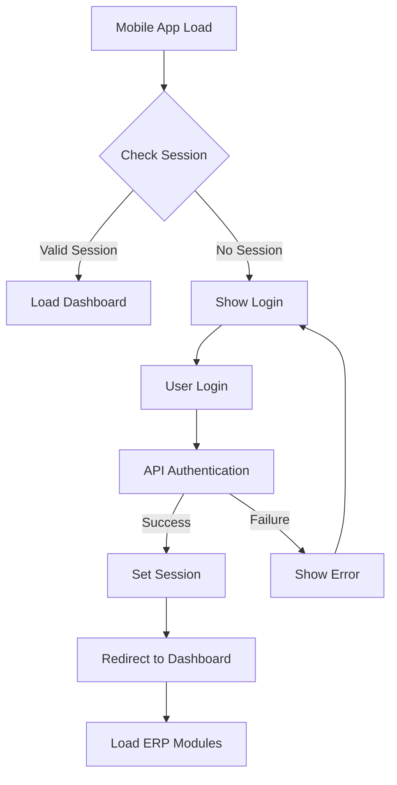

# Mobile ERP Login Fix - Design Document

## Overview

This design addresses the critical mobile ERP login loop issue by implementing robust session management, improving authentication flow reliability, and ensuring consistent user experience. The solution focuses on fixing race conditions, improving error handling, and establishing reliable session persistence.

## Architecture

The mobile login system consists of three main layers:

1. **Frontend Layer**: Mobile web application with authentication UI and session management
2. **API Layer**: Flask backend with authentication endpoints and session handling
3. **Session Layer**: Server-side session storage with proper cookie configuration



## Components and Interfaces

### Frontend Components

1. **Authentication Manager**
   - Handles login form submission
   - Manages session state checking
   - Coordinates UI transitions

2. **Session Validator**
   - Checks authentication status on app load
   - Validates session before API calls
   - Handles session expiration

3. **UI Controller**
   - Manages screen transitions
   - Shows/hides login and dashboard screens
   - Handles loading states

### Backend Components

1. **Authentication API**
   - `/api/auth/unified-login` - User authentication
   - `/api/auth/user-info` - Session validation
   - `/api/auth/logout` - Session termination

2. **Session Manager**
   - Flask session configuration
   - Cookie security settings
   - Session persistence handling

## Data Models

### Session Data Structure
```python
session = {
    'user_id': str,           # Unique user identifier
    'user_type': str,         # 'admin', 'client', 'employee', etc.
    'user_name': str,         # Display name
    'is_super_admin': bool,   # Admin privileges flag
    'login_time': datetime,   # Session creation time
    'last_activity': datetime # Last API call time
}
```

### Authentication Response
```json
{
    "message": "Login successful",
    "token": "jwt-token-string",
    "user": {
        "id": "user-id",
        "name": "User Name",
        "type": "user-type",
        "is_super_admin": false
    }
}
```

## Correctness Properties

*A property is a characteristic or behavior that should hold true across all valid executions of a system-essentially, a formal statement about what the system should do. Properties serve as the bridge between human-readable specifications and machine-verifiable correctness guarantees.*

Property 1: Successful login establishes persistent session
*For any* valid user credentials, when submitted through the login form, the system should authenticate the user and create a session that persists across requests
**Validates: Requirements 1.1**

Property 2: Authentication success triggers dashboard display
*For any* successful authentication, the system should immediately show the dashboard and hide the login screen without requiring additional user action
**Validates: Requirements 1.2**

Property 3: Valid sessions enable automatic dashboard loading
*For any* mobile app initialization with an existing valid session, the system should automatically display the dashboard without showing the login screen
**Validates: Requirements 1.3**

Property 4: Session validation consistency across API calls
*For any* sequence of API calls within a valid session, all calls should return consistent authentication status without session-related failures
**Validates: Requirements 1.4, 2.3**

Property 5: Page refresh preserves authentication state
*For any* authenticated user session, refreshing the mobile app page should maintain the logged-in state and display the dashboard
**Validates: Requirements 1.5**

Property 6: User info endpoint returns valid data for authenticated sessions
*For any* valid session, calling `/api/auth/user-info` should return HTTP 200 status with complete user information
**Validates: Requirements 2.1**

Property 7: Session cookies persist across requests
*For any* successful login, the system should set session cookies that are included in all subsequent requests to maintain authentication
**Validates: Requirements 2.2**

Property 8: Authentication checks complete within time limits
*For any* authentication status check, the system should respond within 2 seconds to prevent UI blocking
**Validates: Requirements 2.4**

Property 9: Session cookies have secure configuration
*For any* session cookie created during login, it should have httpOnly and secure flags set with appropriate expiration time
**Validates: Requirements 2.5**

Property 10: Invalid credentials show error without navigation
*For any* invalid login credentials, the system should display an error message and remain on the login screen
**Validates: Requirements 3.1**

Property 11: Network errors are handled gracefully
*For any* network connectivity issue during login, the system should show an appropriate error message and allow retry without crashing
**Validates: Requirements 3.2**

Property 12: Session validation failures return to login
*For any* unexpected session validation failure, the system should log the error and gracefully redirect to the login screen
**Validates: Requirements 3.3**

Property 13: API errors prevent infinite loops
*For any* API endpoint error response, the system should handle the error without causing infinite reload loops
**Validates: Requirements 3.4**

Property 14: Ambiguous authentication defaults to login
*For any* ambiguous authentication state, the system should default to showing the login screen rather than causing loops or crashes
**Validates: Requirements 3.5**

Property 15: App initialization checks authentication quickly
*For any* mobile app initialization, the authentication status check should complete within 1 second
**Validates: Requirements 4.1**

Property 16: Login processing completes within time limit
*For any* login form submission, the authentication processing and result display should complete within 3 seconds
**Validates: Requirements 4.2**

Property 17: Loading indicators appear during dashboard loading
*For any* dashboard loading operation, loading indicators should be displayed to provide user feedback
**Validates: Requirements 4.4**

Property 18: Authentication results are cached appropriately
*For any* repeated authentication checks within a short time period, the system should use cached results to avoid redundant API calls
**Validates: Requirements 4.5**

## Error Handling

### Session Management Errors
- **Invalid Session**: Return 401 status and clear client-side session data
- **Expired Session**: Redirect to login with appropriate message
- **Session Corruption**: Clear all session data and restart authentication flow

### Network Errors
- **Connection Timeout**: Show retry option with exponential backoff
- **Server Unavailable**: Display offline mode message with retry capability
- **API Errors**: Log errors and show user-friendly messages

### UI State Errors
- **Race Conditions**: Implement proper state locking during transitions
- **Memory Leaks**: Clean up event listeners and timers on logout
- **Browser Compatibility**: Graceful degradation for older browsers

## Testing Strategy

### Unit Testing
- Test individual authentication functions
- Verify session cookie configuration
- Test error handling for edge cases
- Validate UI state transitions

### Property-Based Testing
The testing approach will use **Playwright** for end-to-end property-based testing, as it provides excellent support for browser automation and can simulate real user interactions with the mobile web application.

**Configuration Requirements:**
- Each property-based test MUST run a minimum of 100 iterations
- Tests MUST use Playwright's browser automation capabilities
- Tests MUST simulate real mobile browser environments
- Tests MUST include network condition variations (slow, fast, offline)

**Property Test Implementation:**
- Generate random valid and invalid credential combinations
- Simulate various network conditions and timing scenarios
- Test session persistence across page reloads and navigation
- Verify error handling with randomly generated error conditions
- Test performance requirements with timing measurements

### Integration Testing
- Test complete login flow from UI to database
- Verify session persistence across server restarts
- Test concurrent user sessions
- Validate API endpoint integration

### Performance Testing
- Measure authentication response times
- Test session validation performance
- Monitor memory usage during extended sessions
- Validate mobile network performance